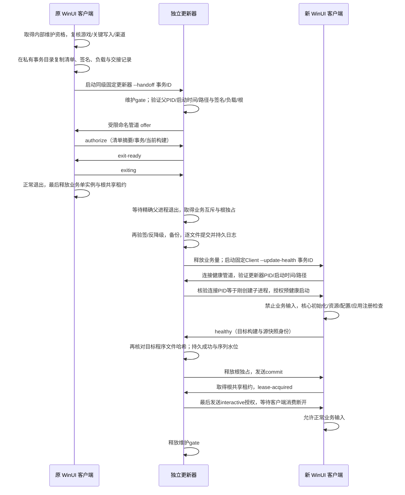

# ADR 0007 · 稳定入口、独立更新器与可恢复程序文件事务

Lab Chronicles AutumnOS · 制作人：派蒙。

这是 T05 采用的实现协议；实际运行、升级、回退及中断测试结果以对应构建报告为准，源码和本说明本身不代表通过。

## 文件布局与部署边界

`AutumnOS.exe` 为 .NET 10 / win-x64 自包含单文件 Bootstrap。原 WinUI 程序改为同目录 `AutumnOS.Client.exe`，其 DLL、PRI、XBF 与 Windows App SDK 资源仍保留在原发行根。独立 `AutumnOS.Updater.exe` 也为自包含单文件；启动时从自己的 bundle 加载协议、验证器和内嵌可信公钥，不依赖正在替换的发行根 DLL。两个稳定 EXE 永远不属于更新 payload 的文件表。所需更新器协议高于 `1.0.0` 时必须拒绝，改走将来经授权的完整安装包，不能一边执行一边覆盖恢复入口。

可见入口、快捷方式与 `AutumnOS_Data` 原位置不变。生产/test 信任根由各自的编译资源固定，运行参数不能替换。用户可写安装位置及普通权限继续适用，不安装服务、不提升权限、不关闭 TLS。`autumn.install.json` 记录受管理文件的版本、构建、大小与 SHA-256；它由包构建生成，后续由已验签的更新清单重建，不能由更新附件直接覆盖。

## 三种不同的协调对象

1. 业务内 `IMaintenanceCoordinator` 防止 Starting、Foreground、Background、Suspended、Closing 游戏及保存、安装、恢复、身份关键写入与更新提交交叉。它不是跨进程所有权。
2. 独立维护互斥量 `LabChronicles.AutumnOS.Maintenance.v1` 沿用当前用户 SID / Session 范围，但与原 `LabChronicles.AutumnOS.Launcher.v1` 业务单实例量不同。每个量在固定专用线程上获取、释放；不尝试跨进程或跨线程转移 Mutex 所有权。
3. 发行根 `.autumnos-runtime.lock` 使用文件共享语义绑定同一物理根：正常客户端终身持共享读租约；替换及恢复持独占租约，跨登录会话有效。更新前还逐一获取旧程序文件的读写/仅允许删除共享句柄，遇到其他会话中仍映射的旧 EXE/DLL、外部文件占用或不可写文件时，在首次替换前停止。未知目录与数据不在这些句柄范围内。

## 交接和健康时序

命名管道使用原 Launcher 的受保护当前 SID DACL、拒绝远程连接和 first-instance 标志，并再次核对操作系统提供的 PID / Session。消息最大 4096 字节，字段严格解析，不承载任意命令、目标目录、认证 token 或脚本。交接记录最大 16 KiB、过期不超过 4 分钟，一次消费；目标根始终由正在执行的固定更新器位置确定，参数只有规范 GUID。父进程 PID 必须与启动时间和 `AutumnOS.Client.exe` 绝对路径同时吻合。

源清单、签名和 payload 由更新器重新校验。传入摘要不是签名替代。当前安装身份必须匹配交接；正常更新版本必须严格递增、最低更新器可满足、数据兼容可回退。`security.json` 保留最高已接受序号及对应摘要、失败 BuildId，回退不清除此状态。重复序号不同清单被拒绝，失败构建不会自动重新提交。

维护期间再双击新入口只返回更新中信息；直接 Client 也有同样的入口守卫。原 v1 二进制不认识新维护gate，所以替换期间还持有原业务互斥量。若旧 v1 在父进程退出时抢先取得业务量，更新器有界等待后停止，保持旧程序。新客户端启动时旧 v1 若抢占业务量，健康失败，恢复必须重新取得业务量及根独占；不能强杀未知旧窗口。没有任何原始单实例协议的历史二进制仍是显式兼容边界，不宣称能改变旧程序行为。

## 持久日志与恢复

事务属于发行根 `.autumnos-update/<GUID>/`，目录 DACL 仅当前用户。备份、阶段文件、handoff、updater 身份和结果分开。根 `journal.json` 用临时文件、`Flush(true)`、同目录替换保存；备份和目标替换临时文件同样 flush。普通多文件复制并非原子操作：`backedUp → applying → health → committed` 记录可恢复状态，失败为 `rollingBack → rolledBack`，首次替换前占用失败为 `aborted`。

首次写程序前完整验证旧 receipt、所有旧文件、完整备份、目标清单和空间。只允许替换已有 receipt 拥有的文件，增加目标清单列出的新文件，以及删除明确列出且旧 receipt 拥有的文件。未知同名文件拒绝覆盖。阶段文件使用前及复制后再次验证，路径拒绝重解析点、绝对路径、越界、ADS、保留名称、大小写碰撞、稳定引导、数据和维护目录；不执行安装脚本。

真实 Windows 演练暴露了额外的文件共享边界：旧目标持有 `FileAccess.ReadWrite / FileShare.Delete` 防占用句柄时，`File.Move(temp,target,true)` 会返回 `UnauthorizedAccessException / 0x80070005`，即使读取文件属性成功。当前实现保留这些防占用句柄，先把旧目标改名到同卷私有事务 `retired/<相对路径>`，再将已 flush/验哈希的新临时文件改名到空目标。两次改名之间不是原子事务，完整已验证备份与先前持久 `applying` 日志覆盖这一恢复边界。`retired` 不作为唯一恢复来源，失败时仍验证并使用完整 `backup`。

实际文件事务的失败写入事务内 `failure.json`；独立更新器的 `last-error.json` 同时给出固定错误码、异常类型、十六进制 HResult、操作阶段和受管理相对文件名，不写任意异常文本、绝对用户路径或数据内容。应用阶段失败但旧版已完整恢复时返回 `UPDATE_ROLLED_BACK`，由独立入口重新打开 A；首次替换前文件占用则持久 `aborted/UPDATE_FILES_BUSY`，返回 `UPDATE_APPLY_ABORTED_FILES_BUSY` 并安全重开未改动 A，两者都不是更新成功。

启动健康超时为 90 秒，父进程正常退出预算 45 秒，获取业务互斥预算 15 秒，主进程等待交接预算 45 秒。健康失败时只可终止本更新器刚创建且 PID/启动时间一致的预健康子进程；该进程尚未允许游戏/用户输入。不能按进程名结束，也不处理用户已有窗口。确认退出后才恢复。

客户端取得根共享租约并发送 `lease-acquired` 后仍不得交互，必须收到最终 `interactive` 消息。更新器一旦在真实核心检查后持久化 `committed`，此后最终 IPC 丢失只记 `UPDATE_FINAL_ACK_UNCERTAIN`，不再杀进程或回滚。这样无法将“授权消息可能已送达”误当作可以终止已开始输入的客户端。未收到最终授权的客户端以启动错误退出，用户再次从稳定入口打开已验证 B；终态日志仍指向 B。

恢复先验证全部旧备份哈希，再写恢复状态、逐文件恢复与旧 receipt。由本事务新增的文件仅在字节仍等于目标清单时删除，遇到用户改动保留并报告。原数据与未知文件不回滚、不清理。成功恢复后固定 `AutumnOS.exe` 重新打开旧版；恢复失败保留日志/备份，下一次入口继续要求恢复而不启动半更新业务。

如果更新器中断，稳定入口发现非终态日志先启动固定 `AutumnOS.Updater.exe --recover`。仍活着的精确健康子进程、其他业务拥有者或根占用会延后恢复，不强杀它们。中断测试可证明进程终止边界，不可据此声称真实断电已测。恢复备份的信任来源是私有本地事务与原安装 receipt，不宣称能抵抗已经能以同一 Windows 用户改写程序及私有日志的恶意软件。

## 数据迁移与保留

本协议只接受数据 schema 1、最低读取版本不高于 1、明确 `rollbackCompatible=true` 的目标；尚未实现通用不可逆迁移，遇到更高格式立即拒绝。更新器不复制、解密、清空或分发 `AutumnOS_Data`，同用户同根的 DPAPI 账号密文、桌面设置、安装应用和存档原位保留。数据迁移扩大范围前须新增具体迁移器、备份范围及回退验证，不能靠改兼容字段启用。

不自动清理旧事务备份，便于失败取证；空间不足明确停止。后续有限保留策略尚待实现时如实记录，不能递归删除发行目录、旧实验包或未知文件。Bootstrap/Updater 的内嵌信任根升级需要受控完整安装；客户端 payload 不能隐式更换恢复程序的信任根。

## API 对接

`UpdateLaunchGuard.Enter(root,args)` 在业务选举和数据初始化前执行，返回终身租约。`UpdateHealth.ReportCoreReadyAsync(buildId,sourceSnapshotId)` 只在真实核心检查后调用，等待持久确认和根租约接续后才恢复输入。

`UpdaterHandoff.PrepareAsync(root,manifestPath,signaturePath,payloadPath,currentBuildId,currentVersion,ct)` 必须在内部排他维护资格期间调用。返回事务 ID 表示独立更新器允许原客户端正常退出，不表示更新成功；不得在返回后释放内部维护资格继续工作。

安装器/卸载器取得 `UpdateMutexLease.AcquireMaintenance()`、业务互斥及 `UpdateRootLease.AcquireExclusive(root)` 后才修改程序文件，数据默认保留。`UpdateTransaction.NeedsRecovery/IsFailedBuild/HighestSequence` 供入口、更新页和诊断对接。测试中的文件恢复夹具、协议负测、真实 Windows A/B 演练和真实身份测试应分别报告。
