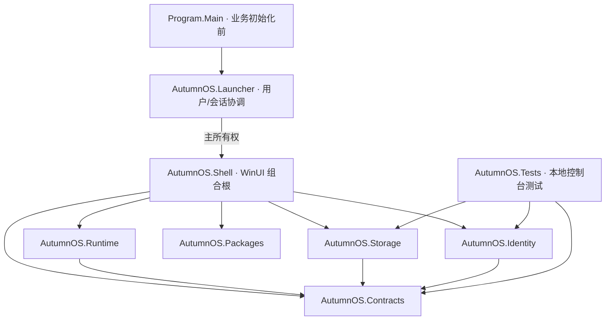

# T00 / T01 架构与模块边界

制作人：派蒙。适用版本：0.1.0-t01。这里描述当前代码；完整功能需求仍由 autumnos-spec 保留。

Shell 调用模块服务准备数据、推进首启检查点、加载桌面应用并展示设置；原目录/配置面板归于设置中的开发者诊断。Storage 负责实际入口路径、12 个数据目录、首启文件、桌面外观原子保存和受限日志。Identity 负责公开配置和 OIDC 发现校验，尚不产生登录会话。Contracts 保存构建生成的品牌和内部协议草案。测试项目不进入客户端发行输出。

`build/Brand.props` 是产品名、显示名、制作人和版本的唯一构建来源；每个程序集带 BuildId 与 SourceSnapshotId。源清单与构建输出哈希位于 artifacts/builds。没有 Git 要求。

## 内部协议草案 v1

启动器使用独立的固定长度召回协议，见 [ADR 0003](adr-0003-launcher-single-instance.md)。它与下述内部游戏 SDK 协议、未来 T05 维护锁分别管理。业务初始化前取得同用户/会话互斥所有权，次实例仅通过受限本地管道召回窗口；参与协议的不同版本/发行路径不改变协调名，次实例不接触任何数据根。

当前代码定义 AppIdentity(AppId, RepositoryId?, SigningKeyFingerprint?)、AppInstanceId(Guid)、SessionEpoch(long)、ServiceError(Code, Message, Retryable, CorrelationId)。运行状态为 Starting / Foreground / Background / Suspended / Closing / Closed / Crashed。前五种游戏状态都阻止维护；当前只是经过单测的领域判断，并没有把它冒充跨进程维护锁。

上述类型是宿主内部合同，不是 JavaScript SDK。T01 RuntimeSession 已将身份、实例、来源及代次绑定到宿主连接，不接受消息自行指定 appId。未知或未实现能力返回 CAPABILITY_UNAVAILABLE。最小 SDK 与消息/schema 见 sdk-t01.md；完整账号切换仍待 T03。

## 后续模块的归属

| 阶段 | 必须实现的模块 | 状态 |
|---|---|---|
| T01 | Runtime、SDK 网关、最小包解析与内部应用 | in_progress |
| T02 | 桌面 Shell、SystemApps、Settings、Notifications、个性化 | in_progress；用户授权的桌面中间检查点 |
| T03 | 真实 Identity、Permission、Storage/Save、DeveloperTools | planned |
| T04 | Store、GitHubClient、Download、PackageManager、代理 | planned |
| T05 | Update、独立 Updater、共享维护锁、签名与恢复 | planned |
| T06 | Diagnostics 集成、完整 SDK/文档、双包与全量验收 | planned |

这些是保留的边界，尚未创建空服务伪装实现。系统应用调用服务；公开 SDK 不暴露包管理、任意命令、宿主路径或登录令牌。无认可名单，pm/sq 自标不会改变权限。

Shell 的 WebAppHost 是 UI/WebView2 组合层，只运行构建随附的元素配对包；不承诺它是一般不可信应用的完整沙箱。每次运行使用独立 origin、应用专属游客 profile 和 InPrivate 控制器；资源只由宿主按已验证包提供，CSP 拒绝外联、框架与 worker，并拦截资源、新窗口、下载、外部协议和浏览器权限。宿主对象与开发工具关闭。WebRTC 等不经过普通 HTTP 资源事件的通道尚需实测/更强隔离，见 runtime-security.md；T01 不得因此标为全部通过。

集成负责人串行修改解决方案、依赖、Contracts、schema 和发布脚本。模块负责人只改所属源码与测试，提交本地审查记录。参见 local-review-template.md。
